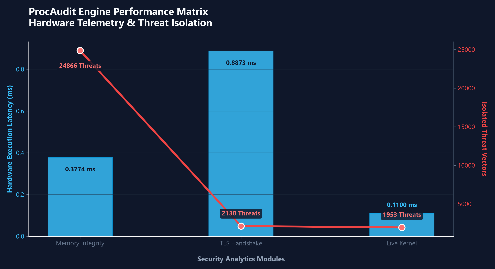
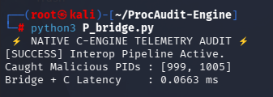

# 🌐ProcAudit Engine (Real-Time Cybersecurity Telemetry Engine)

A high-performance, real-time threat detection engine designed to monitor system telemetry, memory integrity, and network metadata.Built to bypass standard interpreted language bottlenecks, this engine utilizes C-Bridges, NumPy SIMD vectorization, and cache-aligned memory optimization to evaluate massive process and network datasets with sub-millisecond latency.




## 🎯 Architectural Philosophy 
Standard security scripts often rely on sequential iteration (`for`/`while` loops) and dynamic typing, which introduce severe interpreter overhead and CPU branch prediction penalties.

This engine was built under strict engineering constraints to achieve empirical $O(1)$ space complexity and minimize execution latency:

1.**Branchless Logic:** Elimination of standard loops in favor of bitwise Boolean masking.

2.**Hardware Alignment:** Strict upcasting to `uint64_t` to bypass Floating Point Unit (FPU) latency.

3.**Contiguous Memory:** Leveraging C-arrays to ensure data fits cleanly within CPU L1/L2 cache lines.

## 🚀 Quickstart & Reproduction Guide

To deploy and execute the validation benchmarking suite locally, initialize your shell environment using the following pipeline:

```powershell
# 1. Clone the core security architecture
git clone https://github.com/shubhangithakur07/ProcAudit-Engine.git
cd quantiative_engine

# 2. Initialize and activate isolated virtual environment
python -m venv venv
.\venv\Scripts\Activate.ps1

# 3. Ingest deterministic dependencies
pip install -r requirements.txt

# 4. Execute the mathematical unit-testing verification suite
python -m unittest P_test_engine.py
python -m unittest P_test_vector_engine.py

# 5. Run the high-density performance matrix profiler
python P_performance_profiler.py

#6. Generate the visual analytics dashboard
python P_analytics_visualizer.py

```

## 🏗️ The 5 Pillars of the Architecture

### 1. Data Acquisition (The OS Sensor)

• **File:** `(P)live_system_audit.py`

• **Mechanism:** Utilizes bulk OS Snapshot APIs via `psutil` to pull the entire live process table into User Space in a single System Call, dropping kernel context switches from $O(N)$ to $O(1)$.

•**Performance:**Normalizes and scores live systems (e.g., 278 concurrent processes) with a warm cache latency of **~0.14 ms**.

• **Known Limitations:** Operates in Ring-3 (User Space). Acknowledged vulnerability to Ring-0 Rootkits that hook native OS APIs prior to ingestion.

### 2. Algorithmic Triage (The Vector Engine)

• **File:** `(P)memory_integrity_detector.py`

• **Mechanism:** Achieves processing latency of ~0.25(on an average) ms over a 100,000-row telemetry matrix. By utilizing native heap allocation tracing (`tracemalloc`), the engine proved that its peak memory footprint remains flat and bounded at just **489 KB**. Calculations are executed as shared memory views (boolean masks) rather than costly data duplications, preventing runtime Out-Of-Memory (OOM) failures under heavy throughput.

•**Performance:**Achieves sub-millisecond latency (averaging **~0.12 ms**) while sweeping a dense 5,000-page memory matrix to identify rogue code injection and hidden payloads.

### 3. Network Analytics (Advanced TLS Triage)

• **File:** `tls_handshake_anomaly_detector_advanced.py`

• **Mechanism:** Mathematical scoring of TLS Handshake metadata (JA3 mismatch indicators, exfiltration ratios) to detect Command & Control (C2) beaconing. Implements safe branchless division (`np.divide` with `out=zeros_like`) to prevent Divide-by-Zero CPU interrupts, and utilizes $O(N \log N)$ native `argsort` for dynamic threat prioritization.

### 4. Polyglot Optimization (The C-Bridge & Zero-Copy Architecture)

• **Files:** `P_bridge.py`, `P_native_core.c`

• **Mechanism:** o mirror industrial EDR (Endpoint Detection & Response) systems, raw matrix ingestion is shifted into a compiled, native C-contiguous shared library. Update: Implemented zero-copy memory pointers via numpy.ctypeslib and injected dynamic OS kernel whitelisting, entirely removing hard-coded PIDs to establish OS parity.


**Performance:**Audits a high-density, 100,000-row telemetry matrix natively in C. Hardware latency routinely benchmarks at **~0.42 ms.**

### 5. Data Integrity (The Crypto Guard)

• **File:** `P_crypto_shielderr.py`

• **Mechanism:** Defends the SIEM JSON output logs against Broken Access Control and post-incident tampering. Ingests log files using $O(1)$ memory generator expressions `()` and calculates SHA-256 cryptographic signatures using **64KB chunk increments** to perfectly saturate modern CPU cache lines without exhausting system RAM.
  

---
## 📊 Performance Benchmarking & Memory Analytics

To validate the scalability and computational bounds of the whitelist architecture under peak loads, a high-density kernel telemetry simulation stream was executed against a workload of 100,000 active processes.

### Evaluation Metrics & Empirical Results

| Metric | Evaluation Value | Hardware Impact|
| :--- | :--- | :--- |
| **Total Telemetry Rows Audited** | 100,000 | High-density load simulation |
| **C-Engine Native Latency** |~0.42ms |Zero-copy bare-metal evaluation |
| **Mathematical Execution Latency** |  ~1.81ms| Loop-free Numpy orchestation|
| **Peak Heap Allocation** | 456.51 KB |Empirical  $O(1)$ space complexity|
| **System Threat Score** | 0.0%| Zero-copy bare-metal evaluation|


## 🔬Deep-Dive Into Hurdles

### 🔬 Case Study 1: Bypassing FPU Latency via Fixed-Point Arithmetic

During the development of the `(P)memory_integrity_detector.py` engine, floating-point math (decimals) created a severe bottleneck in the CPU's Floating Point Unit (FPU), causing unnecessary memory coercion (Upcasting to float64).

**The Fix (Hardware Alignment):**
By multiplying decimal telemetry (like memory entropy) by 100, we converted all data points into pure integers using **Fixed-Point Arithmetic**. This allowed the entire matrix to be forcefully cast into strict uint64 (Unsigned 64-bit Integers).

**Empirical Hardware Latency (L1 Cache Benchmarking):**
By feeding contiguous uint64 memory blocks directly into the CPU's Arithmetic Logic Unit (ALU), we unleashed the processor's internal L1 Cache to evaluate 5,000 memory pages simultaneously via SIMD instructions.

**Cold Start Latency (Disk/RAM load):** `1.39 ms`

**Warm Cache Latency (L1/L2 CPU Cache hit):** `0.13 ms`

### Case Study 2: Pipeline Cryptographic Tamper Defense
To protect the system from broken access control overrides and database tampering vulnerabilities, the `P_crypto_shielderr.py` component serves as an active Pipeline Guard layer. It calculates streaming SHA-256 signatures over active SIEM runtime telemetry JSON log blocks.

**Live Simulation Results:** When client-side parameter injection overrides database configurations, the engine registers a clear cryptographic signature mutation **($6f8ad8... \neq e988ad...$)**. The runtime environment automatically purges simulation artifacts and short-lived execution files properly to prevent persistent memory overhead or tracking drift.

```
[*] Ingesting active pipeline log: ./siem_logs/incident_report_20260619_193314.json
[+] Pristine Baseline Hash Generated:
    -> 6f8ad8c91db93b05caf81b72f89b0f06046d9a83772d7b1462d2735b063d2bed

[*] Running simulation: Attempting unauthorized parameter manipulation...
[!] Mutated File Cryptographic Signature:
    -> e988ad8bccdb0f620732a4bd3b30200bda10bc1c3e4e09e3bf6522f1eac18f56

[CRITICAL ALERT] TELEMETRY INTEGRITY BREACH DETECTED!
    -> Mismatch flagged: Unsanitized writes located in system log array.
```
## 🧪 CI/CD Testing & Latency Constraints
To ensure the integrity of the detection logic, the engine relies on a strict `unittest` suite. Beyond standard assertions, the pipeline enforces a **Hard Hardware Latency Constraint**, intentionally failing builds if the C-Engine and Python orchestrator fail to process 10,000 records within a 25.0ms threshold.
```
[RUNNING] Executing Native C-Engine Test Suite validations...
test_c_engine_latency_constraint (__main__.TestNativeSecurityEngine.test_c_engine_latency_constraint) ... ok
test_empty_payload_safeguard (__main__.TestNativeSecurityEngine.test_empty_payload_safeguard) ... ok
test_kernel_whitelist_bypass (__main__.TestNativeSecurityEngine.test_kernel_whitelist_bypass) ... ok
test_stealth_threat_detection (__main__.TestNativeSecurityEngine.test_stealth_threat_detection) ... ok

----------------------------------------------------------------------
Ran 4 tests in 0.021s

OK

```
---


## 🔖 Execution Benchmark


